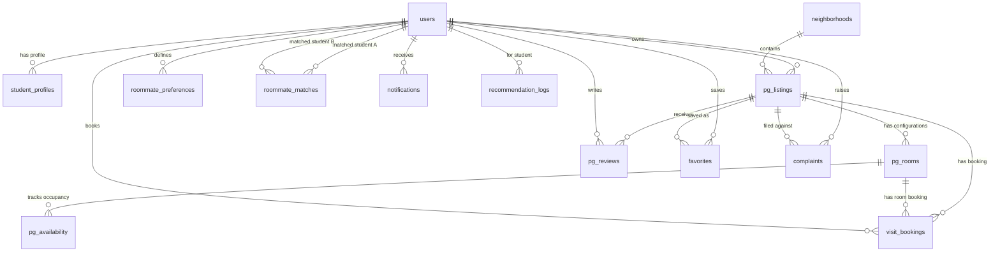

# MOV Stay (Smart Housing Solution for Students)

A comprehensive, full-stack PG and Hostel management platform designed to streamline accommodation discovery, listing management, roommate matching, and property administration for students and property owners. 

Demo Video Link: https://www.youtube.com/watch?v=_NtJcc4slkU 

## 🎨 Branding & Assets

<p align="center">
  
</p>

---

## 💡 Why MOV Stay?

Finding student housing is traditionally filled with friction—unreliable room configurations, outdated bed availability, non-transparent pricing, and stressful roommate matching. 

**MOV Stay** solves this by offering property owners a robust dashboard to manage their properties at a room-by-room level with real-time occupancy updates, while providing students with verified listings, roommate compatibility matching, and visit booking management.

---

## ✨ Key Features

### 🏢 Accommodation & Listing Management (Owner-Side)
- **Comprehensive Listings:** Full CRUD capabilities for PG/Hostel master details (monthly rent, location, description, gender preferences, and active/inactive status).
- **Room Configuration:** Granular room detail management linked to properties (room type, sharing capacity, rent per bed, total beds, AC/Non-AC status).
- **Real-Time Availability:** Dynamically update available beds and tracking history (Available / Limited / Full).

### 👥 Roommate Matching & Student Profiles
- **Compatibility Algorithm:** Match roommates based on sleeping patterns, cleanliness levels, smoking preferences, food choices, and budgets.
- **Preference Analytics:** Student profiles capture detailed preferences to find the best housing fits.

### 🛡️ Authentication & Security
- **Role-Based Access Control:** Separate workflows and views for **Students**, **Owners**, and **Admins**.
- **Social Login:** Google OAuth 2.0 sign-in alongside secure local JWT-based password authentication.

### 📊 Owner Dashboard & Visualizations
- **DataGrid Analytics:** Grid-based visualization using **Material UI DataGrid** with search, sorting, and pagination.
- **Visual Charts:** Interactive charts showing occupancy, rating averages, roommate matching ratios, and property distributions powered by **Recharts**.

### 💼 Operational Workflows
- **Visit Booking System:** Allows students to request physical property visits with status flows (Pending → Approved / Rejected).
- **Complaints Ticketing:** Built-in ticketing support for students to raise complaints to property owners.
- **Cloudinary Image Uploads:** Multi-image uploads via **Multer** and hosting on **Cloudinary** for property listings.

---

## 🛠️ Tech Stack

| Layer | Technologies Used |
|---|---|
| **Frontend** | React 19, Vite, React Router DOM, Axios |
| **UI Components** | Material UI (MUI), Emotion, Material Icons, Recharts |
| **Backend** | Node.js, Express.js 5.x, Passport.js |
| **Database** | MongoDB, Mongoose 9.x |
| **File Storage** | Multer, Cloudinary API |
| **Auth** | JSON Web Token (JWT), Google OAuth 2.0 |
| **Development** | Nodemon, ESLint |

---

## 🗄️ Database Design (MongoDB via Mongoose)

MOV Stay uses a reference-based normalized schema architecture to maintain data integrity and prevent document bloating.

### Relationships Map


### Core Collections Overview

1. **`users`:** Stores usernames, emails, roles (`student`, `owner`, `admin`), and phone numbers.
2. **`student_profiles`:** Captures food, budget, preferred room type, sleep times, and cleanliness scores.
3. **`pg_listings`:** Master PG record storing name, address, rent, amenities, coordinates/location, and owner refs.
4. **`pg_rooms`:** Configures room-specific structures like `Single`/`Double`/`Triple`/`Dormitory`, rents, AC, and total capacity.
5. **`pg_availability`:** Live updates of available beds and immediate status fields.
6. **`visit_bookings`:** Booking calendar matching dates, students, and status values.

---

## 🚀 Getting Started

### 📂 Directory Structure
```text
mov_stay/
├── backend/
│   ├── models/                 # Mongoose schema definitions
│   ├── routes/                 # Express REST API routes 
│   ├── utils/                  # Cloudinary, Mailer, and Google Passport configs
│   ├── middleware/             # Route protection and CORS rules
│   ├── seed.js                 # Seeding script for default DB data
│   ├── server.js               # Express entrypoint
│   └── package.json            # Backend dependencies
└── frontend/
    ├── src/
    │   ├── components/         # Reusable UI wrappers (Navbar, ProtectedRoutes)
    │   ├── pages/              # Main forms and views (Dashboard, Listings, Rooms)
    │   ├── context/            # AuthContext wrapper
    │   └── services/           # Axios API services
    └── package.json            # Frontend dependencies
```

### ⚙️ Environment Configuration

Create a `.env` file in the `backend/` directory using the following template:

```env
PORT=5000
MONGO_URI=your_mongodb_connection_uri
CLOUDINARY_CLOUD_NAME=your_cloudinary_name
CLOUDINARY_API_KEY=your_cloudinary_api_key
CLOUDINARY_API_SECRET=your_cloudinary_api_secret
GOOGLE_CLIENT_ID=your_google_client_id
GOOGLE_CLIENT_SECRET=your_google_client_secret
FRONTEND_URL=http://localhost:5173
JWT_SECRET=your_jwt_secret_phrase
```

### 💻 Running the Application

1. **Clone the repository:**
   ```bash
   git clone https://github.com/yourusername/mov_stay.git
   cd mov_stay
   ```

2. **Start the Backend Server:**
   ```bash
   cd backend
   npm install
   npm run dev
   ```

3. **Start the Frontend Client:**
   ```bash
   cd ../frontend
   npm install
   npm run dev
   ```

4. Open [http://localhost:5173](http://localhost:5173) in your browser to view the application.

---

## 🌐 API Reference

### 🔐 Authentication (`/api/auth`)
- `POST /register` - Register a new user (Student / Owner)
- `POST /login` - Direct JWT Login
- `GET /google` - Redirect to Google Authentication Page
- `GET /google/callback` - OAuth redirect receiver

### 🏢 PG Listings (`/api/pg`)
- `GET /` - Retrieve all PG listings
- `GET /:id` - Retrieve individual PG details
- `POST /` - Register a new PG listing
- `PUT /:id` - Edit PG details
- `DELETE /:id` - Remove PG listing

### 🛏️ Rooms (`/api/rooms`)
- `POST /` - Add a room configuration to a PG
- `PUT /:id` - Modify room capacities and rents
- `DELETE /:id` - Delete room configurations

### 📊 Real-Time Availability (`/api/availability`)
- `POST /` - Create room availability tracker
- `PUT /:roomId` - Update operational bed availability states

---

## 👥 Authors & License

- Built as part of the Web Development Course project portfolio.
- **License:** Distributed under the MIT License.

